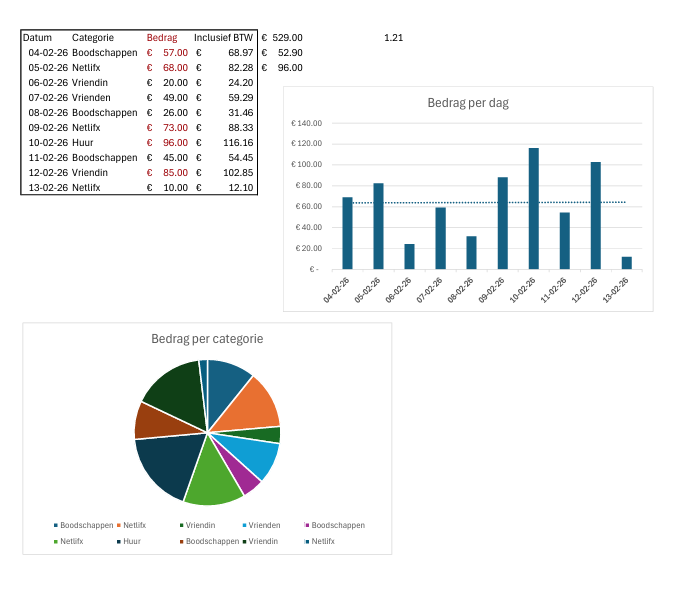
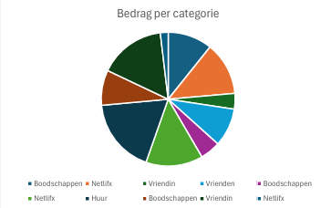
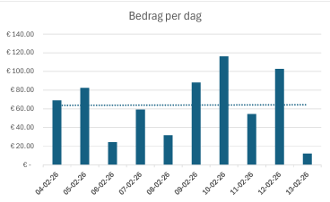

# Monthly-budget-planner
## Introduction

* I made this project to try my new found skills in Excel out. This by making a monthly budget planner.
  
---

## Files
* My projectfile: [Maandelijkse budget planner](./Maandelijkse_Budget_Planner.xlsx)

---

## Used skills
All of the skills I used in this project
*  **📊 Visualisation** used a circeldiagram to see cost for every categorie and a collumn chart to see the evolution of expenses by day
*  **🧮 Formulas and Functions** Used the 5 most important formulas to analyse data ('Sum','Average','Count','Min','Max').
*  **🎨 Conditianal formating** If a expense exceeds 50 euro then color the later red.
---

## charts and graphs

## Conclusion
This project showed me with simpel skills you can already build impresive things in Excel. Making this also makes sure to see if I really understand the concepts that I learn.

